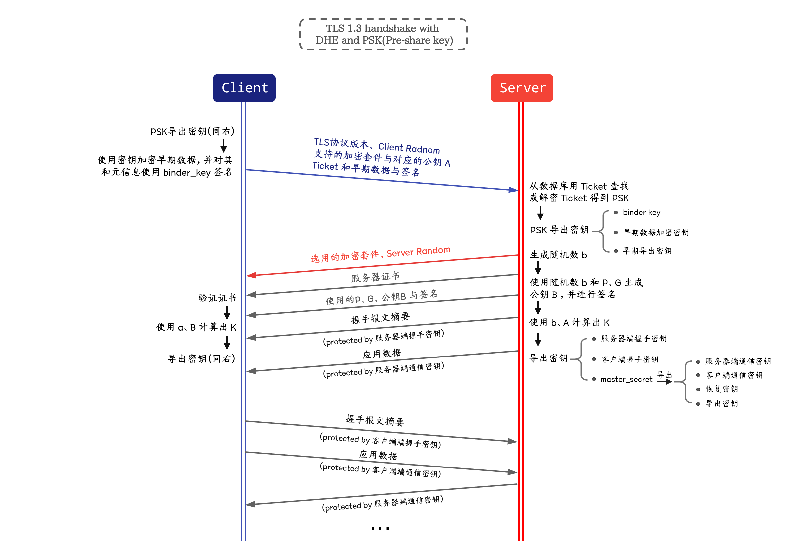

# TLS 1.3 概述

> **参考**
>
> https://www.biaodianfu.com/https-ssl-tls.html
>
> https://zhuanlan.zhihu.com/p/133375078


**TLS 协议主要由两部分组成：**

- 握手协议：确定使用的 TLS 版本、加密类型等，并进行密钥共享。
- 记录协议：使用握手协议中获得的共享密钥来加密通信。

握手协议从 ClientHello 到 Finished。之后是记录协议，发送和接收加密的消息 ApplicationData。

TLS 1.3 的握手如下所示。这也称为完整握手。

```
       客户端                                           服务器

密钥  ^ ClientHello
交换 | + key_share*
     | + signature_algorithms*
     | + psk_key_exchange_modes*
     v + pre_shared_key*       -------->
                                                  ServerHello  ^ 密钥
                                                 + key_share*  | 交换
                                            + pre_shared_key*  v
                                        {EncryptedExtensions}  ^  服务器
                                        {CertificateRequest*}  v  参数
                                               {Certificate*}  ^
                                         {CertificateVerify*}  | 认证
                                                   {Finished}  v
                               <--------  [Application Data*]
     ^ {Certificate*}
认证 | {CertificateVerify*}
     v {Finished}              -------->
       [Application Data]      <------->  [Application Data]
```

- `+` 表示扩展。例如，ClientHello 消息包含 key_share 扩展。
- `*` 表示根据需要发送的消息或扩展。
- `{}` 表示使用 handshake_traffic_secret 加密。
- `[]` 表示使用 application_traffic_secret_N 加密。N 是 Application Data 发送的递增值。

如上图所示，握手分为“密钥交换”、“服务器参数”和“认证”三个阶段。


## 流程概述

### 密钥交换

用于确定加密套件、确定密钥交换算法、得到对方的密钥交换参数。这里，双方会选择的同一套密钥交换算法（TLS 1.3 中，是 Diffie-Hellman 的某一变种），各自本地生成一密钥对（临时私钥、临时公钥），并将临时公钥发送给对方。具体的大致原理，[见本节最后](##密钥交换原理概述)。

**流程上看:** 客户端发送 ClientHello 消息，服务器返回 ServerHello 消息。

- **ClientHello 消息:** 包含随机数 (ClientHello.random)、协议版本列表、共享密钥加密和基于哈希的密钥导出函数 HKDF 的组合列表等。也包括 DH 参数（临时公钥）。
- **ServerHello 消息:** 会返回从客户端支持的协议和算法列表中选择的结果。也包括 DH 参数（临时公钥）。

### 服务器参数

发送除密钥交换之外的其他参数。消息包括 EncryptedExtensions 和 CertificateRequest。

- **EncryptedExtensions:** 对 ClientHello 的 TLS 扩展的回应。
- **CertificateRequest:** 如果只与客户端证书认证的用户通信（即，服务器要求客户提供证书），则发送此消息。对于不需要客户端认证的普通 Web 服务器等，此消息被省略。

### 认证

将服务器证书（和客户端证书）发送给通信对象。消息包括 Certificate, CertificateVerify, Finished。

- **Certificate:** 服务器发送服务器证书。客户端仅在接收到 CertificateRequest 消息时发送客户端证书。
- **CertificateVerify:** 从收到的消息生成并发送签名。此消息的内容用于验证接收的证书上的签名。验证成功后，可以确认该证书确实属于对方。
- **Finished:** 通知密钥交换和认证处理成功。

发送 Finished 时，握手协议完成。

握手协议结束后开始记录协议。记录协议使用密钥交换获得的共享密钥加密数据，并作为 ApplicationData 消息发送和接收。


## 密钥交换原理概述


双方会选择的同一套密钥交换算法（TLS 1.3 中，是 Diffie-Hellman 的某一变种），各自本地生成一密钥对（临时私钥、临时公钥），并将临时公钥发送给对方。

这样，根据 DH 算法原理，若无差错发生，双方可以在本地借助自己的私钥、对方的公钥，生成一相同的密钥。在 TLS 1.2 中，该密钥称为 pre-master secret（预主密钥），在 TLS 1.3 中，称为“共享密钥”（shared-key，功能上很相似），即上图中的 K。

如果，后续验证等全部通过，双方便可通过密钥导出算法（TLS 1.3 中，是 HKDF），导出握手密钥、通信密钥、恢复密钥、导出密钥等，如图所示。这些密钥有些用于握手过程汇总后续步骤的加密，有些用于通信，有些用于实现 0-RTT、PSK 等功能。


## 1-RTT 原理概述

我们知道，TLS 1.2 的握手时间为 2-RTT。TLS 1.3 把 Hello 和公钥交换这两个消息合并成了一个消息，于是这样就减少到只需 1 RTT 就能完成 TLS 握手。

TLS 1.2 的握手有 2 个 RTT，之所以彼处 KeyExchange 要放在第二个 RTT，是由于 TLS 1.2 要支持多种密钥交换算法，和各种不同参数（比如 DH 还是 ECDH 还是 RSA，ECDHE 用什么曲线，DH 用什么群生成元，用什么模数，等），这些算法和参数都依赖第一个 RTT 去协商。

 TLS1.3 禁止了各种自定义DH群，禁止了 ECDH 的自定义曲线，禁止了 RSA 密钥协商，密钥协商的算法只剩下不多几个（且实际上大多数使用同一种椭圆曲线的 ECDH），所以让客户端缓存服务器上一次用的协商算法，把 KeyExchange 直接和入第一个 RTT，客户端在第一个 RTT 里直接就用缓存的这个算法发 KeyExchange 的公钥（即服务器上一次使用的临时公钥）。

如果服务器发现客户端发来的算法不对，那么再告知正确的，让客户端重试即可。 这样，就引入了 HelloRetryRequest 这个消息。

这样，基本没有副作用，就可以降到 1-RTT。

**事实上**，TLS 1.3 还支持某些情况下的 0-RTT。可以使用类似 QUIC 的方法实现（本项目中未实现），也可以使用类似 TLS 1.2 中 session ticket 恢复会话的方式实现（DHE & PSK），需要使用到各类导出密钥，如下图。



