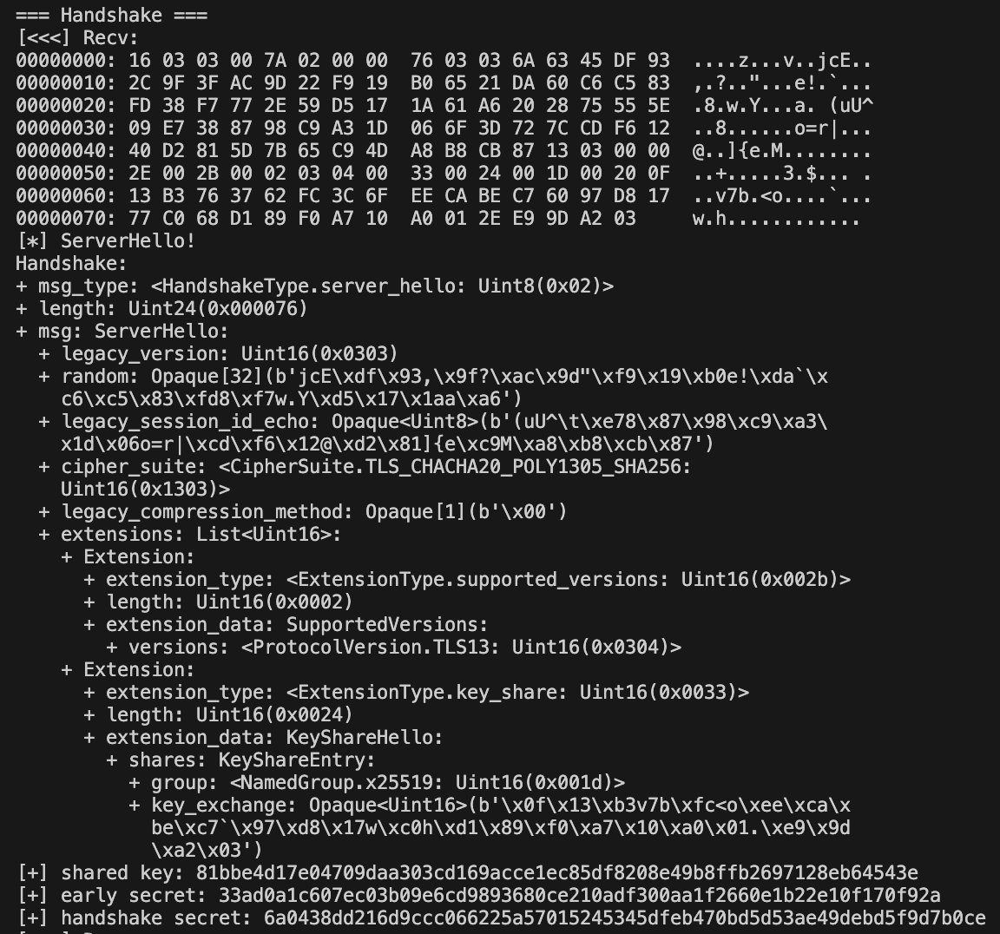

# TLS 1.3 客户端及服务器交互全流程

本节中，将跟随 `main_client.py` 和 `main_server.py` 的实现，考察 TLS 1.3 运行全过程。

由于本项目所有消息的字节级设计均遵循 [RFC 8446](https://tools.ietf.org/html/rfc8446)，故所有报文内容与现实中网络中通行的完全一致。并可直接与现实中使用 TLS 1.3 的其他主机直接通信。


## 握手过程及原理概述

TLS 1.3 的步骤概述、特性原理概述可以在 `/CN_docs/1-Overvuew.md` 中找到，握手过程的各数据结构定义、握手原理分析，可以在 `/CN_docs/3-Handshake_Workflow.md`, `/CN_docs/4-Handshake_principles.md` 中找到。

这里，为了之后代码考察的方便，我们对重点的密钥交换、密钥协商、密钥生成等过程再次（已在 `/CN_docs/1-Overvuew.md` 中讨论过）简要介绍：


双方会选择的同一套密钥交换算法（TLS 1.3 中，是 Diffie-Hellman 的某一变种），各自本地生成一密钥对（临时私钥、临时公钥），并将临时公钥发送给对方。

这样，根据 DH 算法原理，若无差错发生，双方可以在本地借助自己的私钥、对方的公钥，生成一相同的密钥。在 TLS 1.2 中，该密钥称为 pre-master secret（预主密钥），在 TLS 1.3 中，称为“共享密钥”（shared-key，功能上很相似），即上图中的 K。

如果，后续验证等全部通过，双方便可通过密钥导出算法（TLS 1.3 中，是 HKDF），导出握手密钥、通信密钥、恢复密钥、导出密钥等，如图所示。这些密钥有些用于握手过程汇总后续步骤的加密，有些用于通信，有些用于实现 0-RTT、PSK 等功能。

### 过程中导出的所有密钥概述

以下是TLS 1.3握手过程中生成和导出的主要密钥及其用途和生成方式的概述，导出（派生）算法都是使用 HKDF：

1. **早期密钥（Early Secret）** 用于0-RTT数据的加密和解密。从预共享密钥（PSK）或全零值派生。如果使用PSK，它通常来自之前的TLS会话。

2. **握手密钥（Handshake Secret）** 用于握手阶段的消息加密和解密。从客户端和服务器的共享密钥（由密钥交换算法产生）派生。

3. **主密钥（Master Secret）** 用作生成后续会话密钥的基础。从握手密钥派生。

4. **客户端和服务器的应用数据密钥（Client/Server Application Traffic Secret）** 用于加密和解密应用数据。从主密钥派生。
5. **导出器主密钥（Exporter Master Secret）** 用于生成额外的密钥材料，例如用于应用层协议。从主密钥派生。
6. **重新派生的主密钥（Resumption Master Secret）** 用于生成用于后续会话的预共享密钥（PSK）。从主密钥派生。


## Client

> main_client.py

### Client Key Exchange Parameters

Client 生成 ECDH 密钥对。本处采用 x25519 椭圆曲线。


```python
# === Key Exchange Parameters ===

# ECDH with X25519, with Forward Secrecy available
dhkex_class = x25519
# client_private_key
secret_key = os.urandom(32)
# client_public_key
public_key = dhkex_class(secret_key)
```

### Client Hello

创建了一个 TLS 1.3 协议的 ClientHello 消息。本案例中：

1. **客户端支持两种加密套件:**

   - `TLS_CHACHA20_POLY1305_SHA256`: 使用 ChaCha20 流密码和 Poly1305 消息认证码，以及 SHA256 哈希算法。
   - `TLS_EMPTY_RENEGOTIATION_INFO_SCSV`: 特殊的信号加密套件，用于防止 TLS 重协商攻击。

2. **包含了以下几种扩展:** 代码略。

   - **Supported Versions:** 指明客户端支持的 TLS 版本。这里仅支持 TLS 1.3。

   - **Supported Groups:** 指示客户端支持的椭圆曲线或有限域 Diffie-Hellman 组。本项目中，只包含了 `x25519`，是一种 ECDH。

   - **Signature Algorithms:**

     告知服务器客户端支持的签名算法。这对于TLS握手过程中的数字签名验证至关重要。包括了三种基于 RSA-PSS 的签名算法，分别使用 SHA256、SHA384 和 SHA512 哈希算法。

     如 `/CN_docs/4-Handshake_Principles.md` 中所述，签名将用于服务器证书验证（与 “CertificateVerify” 消息相关）。保证安全性，防止中间人攻击等。

   - **Key Share:** 用于在TLS 1.3的握手过程中提前进行密钥交换。客户端在`ClientHello`消息中发送一个或多个密钥共享提议，这有助于加快握手过程。

```python
client_hello = Handshake(
    msg_type=HandshakeType.client_hello,
    msg=ClientHello(
        # Cipher Suites
        cipher_suites=CipherSuites([
            CipherSuite.TLS_CHACHA20_POLY1305_SHA256,
            CipherSuite.TLS_EMPTY_RENEGOTIATION_INFO_SCSV
        ]),
        # Extensions
        extensions=Extensions(
        """
        ...
        """
        )
                )
            )
        ])
    )
)
```

现在，我们将 ClientHello 封装在 TLSPlaintext 中（如同 `/CN_docs/3-Handshake_Structs.md` 中对 TLS 记录层所述），打印：

```python
# Create TLSPlaintext to include Handshake message
tlsplaintext = TLSPlaintext.create(ContentType.handshake, client_hello)
print(tlsplaintext)
print('[>>>] Send:')
print(hexdump(bytes(tlsplaintext)))

# Connect to server & send TLSPlaintext
client_conn = connection.ClientConnection('localhost', 50007)
client_conn.send_msg(bytes(tlsplaintext))

is_recv_serverhello = False
is_recv_finished = False

print("=== Handshake ===")
```

运行时结果如下。由于本项目所有消息的字节级设计均遵循 [RFC 8446](https://tools.ietf.org/html/rfc8446)，故 ClientHello 报文内容与现实中网络中通行的完全一致。


### Client 对接收的消息处理

Client 等待接受消息。进入一个 `while True` 循环。接下来所有代码都位于 `while True` 中。

从服务器接收消息，如果没有消息则阻塞等待。收到的消息后，打印（用十六进制格式），然后转为字节流。

```python
""" In the while True cycle """
# Blocking receive
buf = None
while not buf:
    buf = client_conn.recv_msg(setblocking=True)
# Upon receiving a message, print it, and turn it into a stream
print('[<<<] Recv:')
print(hexdump(buf))
stream = io.BytesIO(buf)
```

内层 `while True` 循环用于解析接收到的消息流。它首先读取流的第一个字节来确定消息的类型（`ContentType`）。针对不同响应类型，做不同处理：

1. **Alert:** 程序将退出。

   ```python
   # handle Alert
   if content_type == ContentType.alert:
       tlsplaintext = TLSPlaintext.from_fs(stream)
       for alert in tlsplaintext.get_messages():
           print('[-] Recv Alert!')
           print(alert)
       sys.exit(1)
   ```

2. **ServerHello:**

   只解析收到的第一个 ServerHello（用  `is_recv_serverhello` flag 来控制是第一个）。打印消息内容，先将 ServerHello 内容存入上下文 `ctx`，准备处理。

   ```python
   # Handle 1st ServerHello
   elif not is_recv_serverhello:
       # ServerHello
       tlsplaintext = TLSPlaintext.from_fs(stream)
       for msg in tlsplaintext.get_messages():
           print('[*] ServerHello!')
           print(msg)
           ctx.append_msg(msg)
   ```

   使用 client 选定的密钥交换算法、临时私钥来设置密钥交换参数。（**注意**，本项目暂时只设计了 client 提供一种密钥交换算法备选的情况，若提供多种（如同时提供 x25519 & FFDHE），暂不支持）。

   设置了共享密钥、早期密钥、握手密钥：`shared_key`, `early_secret`, `handshake_secret`。

   ```python
   # Produce shared key. Using key-exchange alg, and client secret key
   # Similar to pre-master secret in TLS 1.2
   ctx.set_key_exchange(dhkex_class, secret_key)
   Hash.length = ctx.hash_size
   print('[+] shared key:', ctx.shared_key.hex())
   
   # Key Schedule, produce early secret & handshake secret
   ctx.key_schedule_in_handshake()
   
   is_recv_serverhello = True
   ```

   运行时结果如下。由于本项目所有消息的字节级设计均遵循 [RFC 8446](https://tools.ietf.org/html/rfc8446)，故 ServerHello 报文内容与现实中网络中通行的完全一致。

   可以看到，server 响应了 `random`，确定了 `cipher_suite`、`compression_method` 等其他可选项。指示了 server 支持的拓展。

   client 计算出的 `shared_key`, `early_secret`, `handshake_secret` 也一并显示。之后将看到，这部分与 server 计算出的完全一致。说明了密钥交换算法的有效性。

   

3. **ChangeCipherSpec:** 忽略。这里可能会接收到，是出于“宽容接收”的原则，若对方使用 TLS 1.2，可能发来 ChangeCipherSpec。

   ```python
   # Ignore ChangeCipherSpec message
   elif content_type == ContentType.change_cipher_spec:
       # ChangeCipherSpec
       change_cipher_spec = TLSPlaintext.from_fs(stream)
       print(change_cipher_spec)
   ```

4. **加密的 Handshake 消息:**

   如果接收到的是加密的应用数据（`ContentType.application_data`），这通常意味着它包含了加密的握手消息，如`EncryptedExtensions`、`Certificate`、`CertificateVerify`、`Finished`。这些消息被解密并处理。

   特别地，当接收到`Finished`消息时，将`is_recv_finished`标志设置为`True`，表示握手过程即将完成。

   ```python
   # Handle EncryptedExtensions, Certificate, CertificateVerify, Finished
   elif content_type == ContentType.application_data:
       # EncryptedExtensions, Certificate, CertificateVerify, Finished
       print("Got!")
   
       tlsplaintext = TLSCiphertext.from_fs(stream) \
                                   .decrypt(ctx.server_traffic_crypto)
       # print(tlsplaintext)
       for msg in tlsplaintext.get_messages():
           ctx.append_msg(msg)
           print(msg)
   
           if msg.msg_type == HandshakeType.finished:
               print('[*] Received Finished!')
               is_recv_finished = True
               break
   ```

   收到 Certificate 运行时结果如下。由于本项目所有消息的字节级设计均遵循 [RFC 8446](https://tools.ietf.org/html/rfc8446)，故 Certificate 报文内容与现实中网络中通行的完全一致。(报文过长，此处截断)

   
   
   

   类似地，收到 CertificateVerify 和 Finished 运行时结果如下。

   

### Client Finished

现在，client 需要验证 server发送的 Finsih 消息，并发送 client 的 Finish 消息。

- **验证**

  Client 收集所有之前在握手过程中交换的消息（除了服务器的`Finished`消息）。这些消息被串联起来，形成一个字节序列。

  使用 HKDF 从服务器握手密钥（`server_hs_traffic_secret`）中派生出一个`finished_key`。这个密钥专门用于验证`Finished`消息。

  使用 HMAC 和 `finished_key` 对之前消息的累积哈希值进行加密，生成预期的验证数据。并从服务器发送的`Finished`消息中提取实际的验证数据，进行比较。如果它们匹配，这意味着握手过程没有被篡改，且服务器拥有正确的密钥材料。

  ```python
  # verify received Finished
  msgs_byte = b''.join(ctx.tls_messages_bytes[:-1])   # exclude Finished
  finished_key = hkdf.HKDF_expand_label(
      ctx.server_hs_traffic_secret, b'finished', b'', ctx.hash_size, ctx.hash_name)
  expected_verify_data = hkdf.secure_HMAC(
      finished_key, hkdf.transcript_hash(msgs_byte, ctx.hash_name), ctx.hash_name)
  actual_verify_data = \
      ctx.tls_messages.get(
          HandshakeType.finished).msg.verify_data.get_raw_bytes()
  
  if actual_verify_data != expected_verify_data:
      print('decrypt_error!')
      # TODO: create and send Alert msg
      sys.exit(0)
  ```

- **发送 client Finished**

  若验证通过，再次收集所有握手消息的字节序列（包括服务器的`Finished`消息）。生成 `finished_key`，使用 HMAC 加密。

  随后，客户端创建一个包含这个验证数据的 Finished 消息，并将其加密后发送给服务器。

  ```python
  # Send Client Finished
  msgs_byte = ctx.get_messages_byte()
  finished_key = hkdf.HKDF_expand_label(
      ctx.client_hs_traffic_secret, b'finished', b'', ctx.hash_size, ctx.hash_name)
  verify_data = hkdf.secure_HMAC(
      finished_key, hkdf.transcript_hash(msgs_byte, ctx.hash_name), ctx.hash_name)
  
  finished = Handshake(
      msg_type=HandshakeType.finished,
      msg=Finished(
          verify_data=OpaqueHash(bytes(verify_data))
      )
  )
  print(finished)
  
  tlsciphertext = TLSPlaintext.create(ContentType.handshake, finished) \
      .encrypt(ctx.client_traffic_crypto)
  print(tlsciphertext)
  print(hexdump(bytes(tlsciphertext)))
  client_conn.send_msg(bytes(tlsciphertext))
  ```

  到此，client 侧的握手过程全部结束，可以开始传递应用数据。

  运行时结果如下。由于本项目所有消息的字节级设计均遵循 [RFC 8446](https://tools.ietf.org/html/rfc8446)，故 ClientFinished 报文内容与现实中网络中通行的完全一致。

  

### Application Data Sending

本部分详见代码，略。也包含了对 TLS Alert 等特殊信息的处理。并且，实现了一个简单的键盘输入处理线程，允许从命令行发送消息。


## Server

> main_server.py

### Server Key Exchange Parameters

这部分与 [Client Key Exhcange Parameters](###Client-Key-Exchange-Parameters) 基本一致。在密钥交换参数之外，还需要建立通信连接，等待接收的第一个 ClientHello。

本项目中，设定 server 仅支持 `TLS_CHACHA20_POLY1305_SHA256` 加密套件。

```python
# === Key Exchange Parameters ===

dhkex_class = x25519
secret_key = os.urandom(32)
public_key = dhkex_class(secret_key)

server_conn = connection.ServerConnection('localhost', 50007)

buf = server_conn.recv_msg(setblocking=True)
print('[<<<] Recv:')
print(hexdump(buf))

stream = io.BytesIO(buf)

# 1st ClientHello
for msg in TLSPlaintext.from_fs(stream).get_messages():
    print('[*] ClientHello!')
    print(msg)
    print(hexdump(bytes(msg)))
    ctx.append_msg(msg)

# Server CipherSuite only support TLS_CHACHA20_POLY1305_SHA256
client_hello = ctx.tls_messages.get(HandshakeType.client_hello)
has_chacha20poly1305 = client_hello.msg.cipher_suites \
    .find(lambda suite: suite == CipherSuite.TLS_CHACHA20_POLY1305_SHA256)
if not has_chacha20poly1305:
    print('handshake_failure')
    sys.exit(0)
```

运行时结果如下。由于本项目所有消息的字节级设计均遵循 [RFC 8446](https://tools.ietf.org/html/rfc8446)，故 ClientHello 报文内容与现实中网络中通行的完全一致。

这里的 ClientHello 就是我们[先前发出的 ClientHello](###Client-Hello)，可以看到，参数完全一致。


### Server Hello

与 [Client Hello](###Client-Hello) 类似，这里，ServerHello 选择如下选项：

1. **确定加密套件:** `TLS_CHACHA20_POLY1305_SHA256`。
2. **包含了以下几种扩展:** Supported Versions，Key Share。

```python
server_hello = Handshake(
    msg_type=HandshakeType.server_hello,
    msg=ServerHello(
        cipher_suite=CipherSuite.TLS_CHACHA20_POLY1305_SHA256,
        legacy_session_id_echo=client_hello.msg.legacy_session_id,
        extensions=Extensions([
            Extension(
                extension_type=ExtensionType.supported_versions,
                extension_data=SupportedVersions(
                    versions=ProtocolVersion.TLS13
                )
            ),
            Extension(
                extension_type=ExtensionType.key_share,
                extension_data=KeyShareHello(
                    shares=KeyShareEntry(
                        group=NamedGroup.x25519,
                        key_exchange=OpaqueUint16(public_key)
                    )
                )
            )
        ])
    )
)
ctx.append_msg(server_hello)
print(server_hello)
```

另外，这里还会在 Server 侧计算 shared-key、发送 EncryptedExtensions 等，与 [Client 中](###Client-对接收的消息处理)基本一致。

运行时结果如下。由于本项目所有消息的字节级设计均遵循 [RFC 8446](https://tools.ietf.org/html/rfc8446)，故 ServerHello 报文内容与现实中网络中通行的完全一致。


### Server Certificate

根据 `/src/cert/server.key` 构造 certificte。

```python
# create Certificate
with open('cert/server.crt', 'r') as f:
    cert_data = ssl.PEM_cert_to_DER_cert(f.read())

certificate = Handshake(
    msg_type=HandshakeType.certificate,
    msg=Certificate(
        certificate_request_context=OpaqueUint8(b''),
        certificate_list=CertificateEntrys([
            CertificateEntry(
                cert_data=OpaqueUint24(cert_data),
                extensions=Extensions([])
            )
        ])
    )
)
ctx.append_msg(certificate)
print(certificate)
print(hexdump(bytes(certificate)))
```

运行时结果如下。由于本项目所有消息的字节级设计均遵循 [RFC 8446](https://tools.ietf.org/html/rfc8446)，故 Certificate 报文内容与现实中网络中通行的完全一致。注意，实际上，EncryptedExtensions、Certificate、CertificateVerify、Finished 是一起发送，此处仅是打印出观察。


### Service CertificateVerify

根据 `server.key` 来创建。从客户端的 ClientHello 消息中提取客户端支持的签名算法列表。检查客户端支持的签名算法中是否包含 rsa_pss_rsae_sha256`。如果包含，则选择该算法进行签名。

构造一个消息，该消息包括固定的填充字节、一个特定的字符串（"TLS 1.3, server CertificateVerify"），一个零字节，以及到目前为止所有握手消息的哈希值。使用 SHA256 对上述消息进行哈希处理，然后使用 RSA 的 PSS 模式生成签名。

创建一个 CertificateVerify 消息，其中包含选择的签名算法和生成的签名。

```python
# create CertificateVerify
# sign with server private key
key = RSA.importKey(open('cert/server.key').read())
client_signature_scheme_list = \
    ctx.tls_messages.get(HandshakeType.client_hello).msg.extensions \
    .find(lambda ext: ext.extension_type == ExtensionType.signature_algorithms) \
    .extension_data.supported_signature_algorithms
print(client_signature_scheme_list)

if SignatureScheme.rsa_pss_rsae_sha256 in client_signature_scheme_list:
    server_signature_scheme = SignatureScheme.rsa_pss_rsae_sha256
    from Crypto.Signature import PKCS1_PSS
    message = b'\x20' * 64 + b'TLS 1.3, server CertificateVerify' \
        + b'\x00' + \
        hkdf.transcript_hash(ctx.get_messages_byte(), ctx.hash_name)
    print("message:")
    print(hexdump(message))
    h = SHA256.new(message)
    certificate_signature = PKCS1_PSS.new(key).sign(h)
else:
    raise NotImplementedError()

certificate_verify = Handshake(
    msg_type=HandshakeType.certificate_verify,
    msg=CertificateVerify(
        algorithm=server_signature_scheme,
        signature=OpaqueUint16(certificate_signature)
    )
)
ctx.append_msg(certificate_verify)
print(certificate_verify)
```

运行时结果如下。由于本项目所有消息的字节级设计均遵循 [RFC 8446](https://tools.ietf.org/html/rfc8446)，故 CertificateVerify 报文内容与现实中网络中通行的完全一致。注意，实际上，EncryptedExtensions、Certificate、CertificateVerify、Finished 是一起发送，此处仅是打印出观察。


### Server Finished

这部分也与 [Client 中的](###Client-Finished)基本一致。打印出的结果如上，代码略。

现在，需要一起发送 EncryptedExtensions、Certificate、CertificateVerify、Finished。如下。

```python
# send EncryptedExtensions + Certificate + CertificateVerify + Finished
tlsciphertext = \
    TLSPlaintext.create(ContentType.handshake,
                        encrypted_extensions, certificate,
                        certificate_verify, finished) \
    .encrypt(ctx.server_traffic_crypto)
print('[>>>] Send:')
print(hexdump(bytes(tlsciphertext)))

server_conn.send_msg(bytes(tlsciphertext))
```

### Application Data Sending

本部分详见代码，略。也包含了对 TLS Alert 等特殊信息的处理。并且，实现了一个简单的键盘输入处理线程，允许从命令行发送消息。
