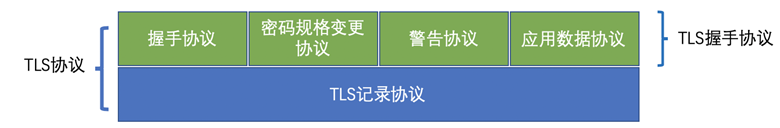
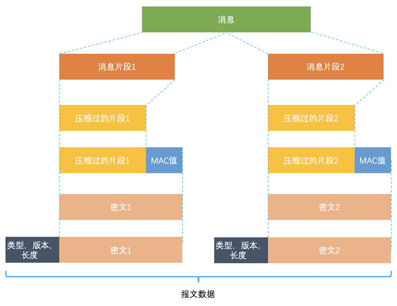

# TLS 1.2 概述

> 参考：[RFC 5246 doc](https://datatracker.ietf.org/doc/html/rfc5246)

为了更好地在后续介绍 TLS 1.3，本节将详细介绍 TLS 1.2 中内容，并在下一节从 TLS 1.2 与 TLS 1.3 的区别出发，对 TLS 1.3 进行概述。


## TLS 1.2 协议架构

协议由两层组成：TLS 记录协议（TLS Record）和 TLS 握手协议（TLS Handshake）。



- 底层的是TLS记录协议，主要负责使用对称密码对消息进行加密。
- 上层的是TLS握手协议，主要分为握手协议，密码规格变更协议和应用数据协议4个部分。
  - 握手协议负责在客户端和服务器端商定密码算法和共享密钥，包括证书认证，是4个协议中最最复杂的部分。
  - 密码规格变更协议负责向通信对象传达变更密码方式的信号(有点冗余，在3里面已经被删掉了)。
  - 警告协议负责在发生错误的时候将错误传达给对方。
  - 应用数据协议负责将TLS承载的应用数据传达给通信对象的协议。


## TLS 1.2 Handshake Protocol

```
Client                                               Server

ClientHello                 -------->
                                                ServerHello
                                               Certificate*
                                         ServerKeyExchange*
                                        CertificateRequest*
                            <--------       ServerHelloDone
Certificate*
ClientKeyExchange
CertificateVerify*
[ChangeCipherSpec]
Finished                    -------->
                                         [ChangeCipherSpec]
                            <--------              Finished
Application Data            <------->      Application Data
```

### Stage 1

#### ClientHello

握手的首个步骤涉及客户端向服务器发送 “Client Hello” 消息。这一消息包括客户端生成的随机数 `Random1`、支持的加密套件 `Support Ciphers`，以及 SSL 版本信息等。

“ClientHello” 消息的关键元素如下：

1. **客户端版本**：列出客户端按优先级排序的支持协议版本，优先选择最新的协议版本。
2. **客户端随机数（Random）**：用于后续的密钥生成过程。
3. **会话 ID（Session ID）**：对于首次连接的客户端，此字段为空。如果非空，表明客户端之前已与服务器建立连接。服务器利用
4. Session ID 映射对称密钥，存储在客户端浏览器中，并设定有效期限。若客户端后续在有效期内重连，可利用此 ID 进行 SSL 会话恢复，避免完整握手。
5. **加密套件**：客户端向服务器发送一组按优先级排列的加密套件。服务器从中选择一种共同的加密套件。
6. **压缩方法**：为减少带宽使用，数据可被压缩。然而，基于历史攻击案例（如 CRIME 漏洞），自 TLS 1.3 起，协议禁用了 TLS 压缩。
7. **扩展包**：其它参数（如服务器名称、填充、支持的签名算法等）可通过扩展包进行传输。


#### ServerHello

服务器检查客户端的 TLS 版本和算法要求。若条件被接受，服务器会发送其证书和其它详细信息；否则，发送握手失败消息。

若接受，服务器通过 “Server Hello” 消息回应，选定一种加密套件，并生成另一随机数 `Random2`。至此，客户端和服务器均拥有两个随机数 `Random1` 和 `Random2`，用于后续的对称密钥生成。

“ServerHello” 中的关键参数包括：

1. **服务器版本（Version）**：服务器选择客户端支持的最新版本。
2. **服务器随机数（Random）**：服务器和客户端各自生成 32 字节的随机数，用于创建加密密钥。
3. **加密套件**：服务器从客户端的列表中选择一种套件。
4. **会话 ID（Session ID）**：服务器将约定的 Session 参数存储于 TLS 缓存，并生成对应的 Session ID。客户端可以将此 ID 存储并设定有效期。在有效期内的重连时，服务器可检查缓存参数并重用，节省计算成本。针对大流量应用（如亚马逊、谷歌等），引入了 Session Tickets 扩展，以优化 TLS 缓存的使用。
5. **压缩算法**：如支持，服务器将同意客户端的首选压缩方法。
6. **扩展包**

此时，双方已明确以下信息：

1. SSL 版本
2. 密钥交换、信息验证和加密算法
3. 压缩方法
4. 密钥生成用的两个随机数


### Stage 2

#### Certificate (optional)

第一次建立必须要有证书，通常情况下，除了会话恢复，SSL 握手过程中都需要包含证书消息。此消息包含一个 X.509 证书，内含公钥，供客户端验证签名或用于密钥交换。

这一步是服务端将自己的证书下发给客户端，让客户端验证自己的身份，客户端验证通过后取出证书中的公钥。

#### ServerKeyExchange (optional)

根据 “ClientHello” 消息中包含的 CipherSuite 信息，决定密钥交换方式（如 RSA 或 DH），并在 “Server Key Exchange” 消息中提供必要的参数。

#### CertificateRequest (optional)

通常用于安全性要求较高的场合。服务器通过此消息请求客户端的证书进行验证。服务器端发出 Certificate Request 消息，要求客户端发送证书过来进行验证。消息中包含服务器支持的证书类型（如 RSA、DSA、ECDSA 等）和信任的 CA 列表，供客户端筛选证书。


#### ServerHelloDone

此消息表示服务器已发送所有必要信息，等待客户端响应。


### Stage 3

#### Certificate (optional)

如服务器在第二阶段请求客户端证书，客户端则在此阶段发送。客户端根据服务器提供的证书类型和 CA 列表选择合适的证书。无证书时，客户端发送 “no_certificate” 警告。


#### ClientKeyExchange

客户端根据服务器的随机数和密钥交换算法计算 `pre-master` 密钥，并发送给服务器，双方据此计算 `main-master`，如此以来双方就算出了对称密钥。


#### CertificateVerify (optional)

只有在客户端发送了自己证书到服务器端，这个消息才需要发送。消息包含对所有握手消息的签名，以验证客户端身份。


### Stage 4

#### ChangeCipherSpec

编码改变通知，表示随后的信息都将用双方商定的加密方法和密钥发送（ChangeCipherSpec 是一个独立的协议，体现在数据包中就是一个字节的数据，用于告知服务端，客户端已经切换到之前协商好的加密套件（Cipher Suite）的状态，准备使用之前协商好的加密套件加密数据并传输了）。


#### Client Finished

表示客户端的握手阶段已经结束。包含前面所有消息的 hash 值，供服务器校验。

将使用 HMAC 算法计算收到和发送的所有握手消息的摘要，然后通过 RFC5246 中定义的一个伪函数 `PRF` 计算出结果，加密后发送。此数据是为了在正式传输应用数据之前对刚刚握手建立起来的加解密通道进行验证。）

#### ChangeCipherSpec

同上，此处为服务器发送。

#### Server Finished

服务端握手结束通知。

1. 使用私钥解密加密的 `pre-master` 数据，基于之前 `(Client Hello 和 Server Hello)` 交换的两个明文随机数 `random_C` 和 `random_S`，计算得到协商密钥: `enc_key=Fuc(random_C, random_S, Pre-Master)`。
2. 计算之前所有接收信息的 hash 值，然后解密客户端发送的 encrypted_handshake_message，验证数据和密钥正确性。
3. 发送一个 ChangeCipherSpec（告知客户端已经切换到协商过的加密套件状态，准备使用加密套件和 `Session Secret` 加密数据了）。
4. 服务端也会使用 `Session Secret` 加密一段 Finish 消息发送给客户端，以验证之前通过握手建立起来的加解密通道是否成功。

根据之前的握手信息，如果客户端和服务端都能对Finish信息进行正常加解密且消息正确的被验证，则说明握手通道已经建立成功，接下来，双方可以使用上面产生的 `Session Secret` 对数据进行加密传输了。


## TLS 1.2 Record Layer



消息首先会经历分段处理，随后进行压缩，再计算消息的验证码，以确保数据的完整性。消息使用对称加密算法进行加密，其中采用了块加密模式（CBC）进行操作。值得注意的是，在 CBC 模式中，初始向量是由主密码 `master key` 生成。一旦消息被加密，系统会向加密后的数据附加额外信息，如消息类型、版本和长度等，以此组成最终的报文数据。

具体来说，从应用层接受数据，并且做：

1. **分片**：将数据划分为更小的部分，以便于传输和处理。在数据接收端，这些片段将被重新组合。
2. **生成序列号**：为每个数据块分配一个独一无二的编号。这一步骤是为了防止数据被重放攻击或错误地重新排序。
3. **压缩（可选）**：根据在握手协议中协商出的压缩算法，对数据进行压缩，以减少传输时所需的带宽。
4. **加密**：利用握手协议中协商出的密钥进行数据加密。在数据接收端，将对这些数据进行解密。
5. **计算并验证 HMAC**：对数据进行 HMAC 计算，并验证接收到的数据包的 HMAC 的正确性，以确保数据的完整性和真实性。
6. **通过 TCP/IP 传输**：将加密后的数据发送给 TCP/IP（或其他 IPC 机制），完成数据的传输过程。

以下部分严格按照 [RFC 5246](https://datatracker.ietf.org/doc/html/rfc5246) 中的描述和数据结构进行介绍。

### SecurityParameters

TLS 1.2 中所有的加密和认证操作均依赖于 `SecurityParameters` 结构体中定义的参数，如下所示：

```c
struct {
    ConnectionEnd          entity;
    PRFAlgorithm           prf_algorithm;
    BulkCipherAlgorithm    bulk_cipher_algorithm;
    CipherType             cipher_type;
    uint8                  enc_key_length;
    uint8                  block_length;
    uint8                  fixed_iv_length;
    uint8                  record_iv_length;
    MACAlgorithm           mac_algorithm;
    uint8                  mac_length;
    uint8                  mac_key_length;
    CompressionMethod      compression_algorithm;
    opaque                 master_secret[48];
    opaque                 client_random[32];
    opaque                 server_random[32];
} SecurityParameters;
```

这些参数被用来生成以下六个关键参数（不是所有加密套件都需要全部六个参数，如不需要则对应参数置空）

```c
client write MAC key
server write MAC key
client write encryption key
server write encryption key
client write IV
server write IV
```

握手过程完成后，这六个参数生成完毕，即可建立连接状态。连接状态除了包含上述 `SecurityParameters`，还包含以下几个动态更新的参数：


- **compression state**：当前压缩算法的状态。
- **cipher state**：加密算法的当前状态，对于块加密算法（如 AES），包括密码预处理生成的轮密钥（round key）和 IV；对于流加密，包括维持加解密过程的状态信息。
- **sequence number**：每个连接状态包含一个序列号，读和写状态有不同的序列号。序列号从 0 开始，每发送一个 record 递增 1，不得超过 $2^64-1$。若序列号达到上限，必须重新协商。


### Record Layer 分段

要发送的数据流首先分段成如下格式：

```c
struct {
    uint8 major;
    uint8 minor;
} ProtocolVersion;

enum {
    change_cipher_spec(20), alert(21), handshake(22),
    application_data(23), (255)
} ContentType;

struct {
    ContentType type;
    ProtocolVersion version;
    uint16 length;
    opaque fragment[TLSPlaintext.length];
} TLSPlaintext;
```

- **version 字段**：定义当前协商出的 TLS 协议版本，例如 TLS 1.2 版本是 `{3, 3}`。
- **length 字段**：定义数据长度，TLS 1.2 协议规定 · 必须小于 $2^14$，过长的 `length` 会增大延迟和破坏用户体验。
- **type 字段**：标识当前 record 是哪一种协议类型。

由于压缩算法可能导致安全漏洞（如 CRIME 和 BREACH 攻击），故所以在实际部署中，一定要禁用压缩。在 TLS 1.3 中已取消压缩。


### Record Layer 密码学保护

经过处理后的包格式定义如下：

```c
struct {
    ContentType type;
    ProtocolVersion version;
    uint16 length;
    select (SecurityParameters.cipher_type) {
        case stream: GenericStreamCipher;
        case block:  GenericBlockCipher;
        case aead:   GenericAEADCipher;
    } fragment;
} TLSCiphertext;
```

TLS 协议的保密（encryption）、完整性（authentication）和防重放功能就在这里实现，主要有三类实现方式：

1. **Block Cipher (CBC mode) + HMAC**：例如 `aes-128-cbc+hmac-sha256`。
2. **Stream Cipher (RC4) + HMAC**。
3. **Authenticated-Encryption (AEAD) 使用块密码（GCM/CCM 模式）**：例如 `aes-128-gcm`。

目前，第 1 和第 2 类算法已被发现存在各种漏洞，最可靠的是第 3 类，即 Authenticated-Encryption。

GCM 模式是 AEAD 的一种，集成了加密和 MAC 认证，因此不需要单独的 MAC 算法。AEAD 的作用类似于 Encrypt-then-MAC，例如 `Sha256 + Salt + AES + IV`。

值得一提的是，在 TLS 协议早期，人们还未意识到 Encrypt-and-MAC、MAC-then-Encrypt 和 Encrypt-then-MAC 这三种结构的安全性差异。TLS 最初使用 MAC-then-Encrypt，但近年来发现这种结构易于构造 padding oracle 攻击，如 BEAST、Lucky 13 和 POODLE 攻击。

因此，学术界目前一致认为 Encrypt-then-MAC 是最安全的。鉴于这种陷阱的严重性，AEAD（Authenticated-Encryption With Additional data）算法被提出，集成加密和 MAC 认证于一个算法内，避免了上述风险。TLS 1.3 中只保留了 AEAD 类算法，废除了 `Block Cipher + HMAC` 和 `Stream Cipher + HMAC`。


#### HMAC, Stream Cipher, CBC Block Cipher, AEAD Cipher 实现

本节中不对具体算法进行深入介绍。三种实现方式的细节和漏洞讨论可参考[本文](https://www.biaodianfu.com/https-ssl-tls.html#TLS_CipherSuite)的 “record层的密码学保护” 部分。


#### 密码拓展

另外值得一题的是 TLS 1.2 中 recard layer 的 “密码拓展”机制。在 TLS 1.2 的握手过程中，生成的 `master_secret` 长度仅为 48 字节。然而，实际上两组加起来的 `encryption key, MAC key, IV` 的总长度通常都会超过 48 字节。以 `AES_256_CBC_SHA256` 为例，所需的总长度达到 128 字节。因此，TLS 协议中引入了一个特殊的函数，用于将这 48 字节的 `master_secret` 延伸至所需长度。这个函数被称为伪随机函数（Pseudo-Random Function，简称 PRF）。

PRF 的主要作用是利用 `master_secret` 作为种子，通过复杂的运算过程，生成一串足够长的密钥材料。这串密钥材料随后被用于生成 `encryption key, MAC key, IV`，从而确保了 TLS 加密所需的密钥长度。这个过程是 TLS 保证安全通信的关键步骤之一，通过有效地扩展密钥材料，保障了加密算法的强度和安全性。

TLS 1.3里面已经废弃了这种方式，改为使用更靠谱的 HKDF。