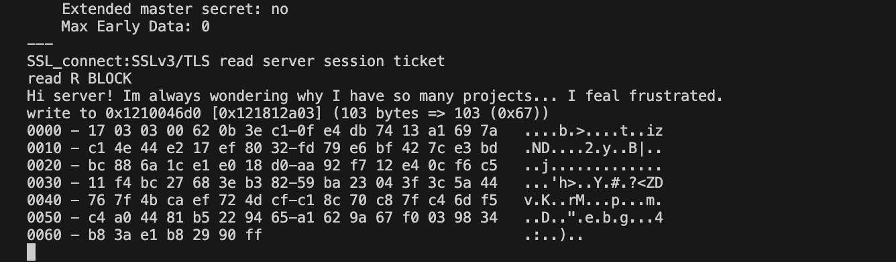

# README

> 🌏🌎 *For EN visitors: The document file structure has been rewritten according to the document structure of [RFC 8446](https://datatracker.ietf.org/doc/html/rfc8446), therefore can be understood by comparing it with the original RFC 8446 document :)*


## Overview

本项目从字节级实现了 TLS 1.3 协议，包括 TLS 记录协议、握手协议、警告协议（TLS 1.3 中已删除密钥交换协议）。

由于本项目所有消息的字节级设计、交互流程均遵循 [RFC 8446](https://datatracker.ietf.org/doc/html/rfc8446) 规范，故所有报文内容与现实中网络中通行的完全一致，并可直接与现实中使用 TLS 1.3 的其他主机直接通信，可通过 OpenSSL 直接运行以得到验证，将以类似 Wireshark 等嗅探器得到的 16 进制报文内容进行输出。在连接成功建立后，允许用户通过键盘在两端进行交互。

### Implemented Featuress

参照 [RFC 8446](https://datatracker.ietf.org/doc/html/rfc8446) 章节：

- 本项目实现了除 Section 4.3.2（Certification Request）外的所有部分。
- 对于 Section 4.4（Extensions），支持 supported_versions、signature_algorithms、supported_groups、key_share 四个拓展。
- 对于密钥交换算法，支持 X25519、X448 两种算法。
- 对于加密和消息认证，支持 ChaCha20-Poly1305 算法。


## Documentation

位于 `./docs/`，中文文档。阅读顺序如下：

1. `TLS_12.md`：TLS 1.2 概述。为了更好地在后续介绍 TLS 1.3，本节将详细介绍 TLS 1.2 中内容。
2. `TLS_13_intro.md`：从 TLS 1.2 与 TLS 1.3 的区别出发，对 TLS 1.3 进行概述。
3. `TLS_13_record.md`：介绍 RFC 8446 - Sec 5 - Record Protocol 中的内容，并给出本项目中的实现。
4. `TLS_13_handshake.md`：介绍 RFC 8446 - Sec 4 - Handshake Protocol 中的内容，并给出本项目中的实现。
5. `TLS_13_extensions.md`：介绍 RFC 8446 - Sec 4.2 - Extensions 中的内容，并给出本项目中实现的 4 个拓展。
6. `TLS_13_alerts.md`：介绍 RFC 8446 - Sec 6 - Alerts 中的内容，并给出本项目中的实现。
7. `code_run.md`：跟随 `main_client.py` 和 `main_server.py` 的实现，考察本项目中 TLS 1.3 运行全过程。


## Files & Code

代码全部位于 `./src/`。


### Descriptions to Files According to Functions

#### Client-Server Implementation

- `client.py`: TLS 客户端
- `server.py`: TLS 服务器

#### Cryptographic Algorithms and Protocol Structures


- `crypto_chacha20poly1305.py`: ChaCha20-Poly1305 密码套件的实现。
- `crypto_hkdf.py`: 基于 HMAC 的密钥派生函数（HKDF）的实现。
- `crypto_ecdhe.py`: ECDH - X25519 密钥交换算法的实现。

#### Protocol Componentss

- `protocol_alert.py`: RFC 8446 - Sec 6 - Alerts 实现。
- `protocol_authentication.py`: RFC 8446 - Sec 4.4. - Authentication Messages 实现。
- `protocol_ciphersuite.py`: RFC 8446 - appendix-B.4 实现
- `protocol_ext_keyshare.py`: key_share 拓展的实现。
- `protocol_ext_signature.py`: signature_algorithms 拓展的实现。
- `protocol_ext_supportedgroups.py`: supported_groups 拓展的实现。
- `protocol_ext_version.py`: supported_versions 拓展的实现。
- `protocol_extensions.py`: RFC 8446 - Sec 4.2 - Extensions 实现。
- `protocol_handshake.py`: RFC 8446 - Sec 4 - Handshake Protocol 实现。
- `protocol_hello.py`: RFC 8446 - Sec 4.1.1 & 4.1.2 - ClientHello & ServerHello 实现。
- `protocol_recordlayer.py`: RFC 8446 - Sec 5 - Record Protocol 实现。
- `protocol_ticket.py`: RFC 8446 - Sec 4.6.1 - New Session Ticket Meessage 实现。
- `protocol_tlscontext.py`: TLS 会话的上下文管理。
- `protocol_types.py`: TLS 协议中使用的各种类型的定义。

#### Utilities and Helpers

- `type.py`: 定义了 `TLS` 的各种数据结构。
- `structmeta.py`: 定义了 `TLS` 的各种数据结构的元类，允许自动解析元类。
- `disp.py`: 实现 hexdump，以 Hex 及 ASCII 形式直接显示 Bin 数据。
- `connection.py`: 抽象了双向 TCP 连接，提供了发送和接收数据的方法。


## Running

### Dependencies

```
python       (Tested with 3.10.13)
cryptography (Tested with 41.0.5)
pycryptodome (Tested with 3.19.0)
```

### Run as Script

需要切换至 `/src`，因为项目代码需要检查 `/src` 目录下的 `/cert` 路径，其中包含 server 证书。

在两个终端分别运行 Server 与 Client。

**Server:**

```bash
cd src
python main_server.py
```

**Client:**

```bash
cd src   
python main_client.py
```

一份典型的运行日志，见 `/examples/server_script.log`, `/examples/client_script.log`。由于本项目所有消息的字节级设计均遵循 [RFC 8446](https://tools.ietf.org/html/rfc8446)，故所有报文内容与现实中网络中通行的完全一致。可查阅两份 log 文件，其中记录了所有交换的报文内容，自然也包括了加密套件、确定的密钥协商算法等（可直接定位到 ServerHello, ClientHello 中查看）。

对于双方协商及后续导出的密钥，可直接在 log 文件中搜索 "shared key", "early secret", "handshake secret", "master secret" 等。可以看到，双方计算出的结果完全一致。

运行后，经过短暂握手过程，即可开始传递应用数据，可任意输入。如下是 client 侧的输入界面，在 “=== Application Data ===” 字样出现后，随时开始输入即可 （下图中，传递应用数据“Hi! How are you?”）。server 侧同理，直接输入内容即可。在一侧发送消息，另一侧也可收到，且可查看完整的字节级报文内容。


### Run as Real TLS 1.3 Server and Client Using OpenSSL

本项目并非简单的“模拟 TLS 1.3 握手过程”。由于本项目所有消息的字节级设计均遵循 [RFC 8446](https://tools.ietf.org/html/rfc8446)，故所有报文内容与现实中网络中通行的完全一致。并可直接与现实中使用 TLS 1.3 的其他主机直接通信，也可作为真实可用的 TLS 1.3 服务器、客户端进行交互。

此处，OpenSSL 的 server 监听端口、client 连接端口均在 50007，与项目中的 server 端口、client 端口一致（见 `./src/main_server.py`, `./src/main_client.py`）。以 `-debug` 参数运行，可查看详细的握手过程。

在两个终端分别运行 Server 与 Client。

**Server:**

```bash
cd src
openssl s_server -accept 50007 -cert ./cert/server.crt -key ./cert/server.key -tls1_3 -state -debug
```

**Client:**

```bash
cd src   
openssl s_client -connect 127.0.0.1:50007 -tls1_3 -state -debug
```

一份典型的运行日志，见 `/examples/server_openssl.log`, `/examples/client_openssl.log`。由于本项目所有消息的字节级设计均遵循 [RFC 8446](https://tools.ietf.org/html/rfc8446)，故所有报文内容与现实中网络中通行的完全一致。

可查阅两份 log 文件，其中记录了所有交换的报文内容。内容为 openssl debug 模式输出，相关内容更容易查找。自然也包括了加密套件、确定的密钥协商算法等（可直接定位到 ServerHello, ClientHello 中查看）。对于双方协商及后续导出的密钥，可直接在 log 文件中搜索 "shared key", "early secret", "handshake secret", "master secret" 等。可以看到，双方计算出的结果完全一致。

运行后，经过短暂握手过程，即可开始传递应用数据，可任意输入。如下是 client 侧的输入界面，在 “read R BLOCK” 字样出现后，随时开始输入即可 （下图中，传递应用数据“Hi server! Im always wondering why I have so many projects... I feal frustrated.”）。server 侧同理，直接输入内容即可。在一侧发送消息，另一侧也可收到，且可查看完整的字节级报文内容。



