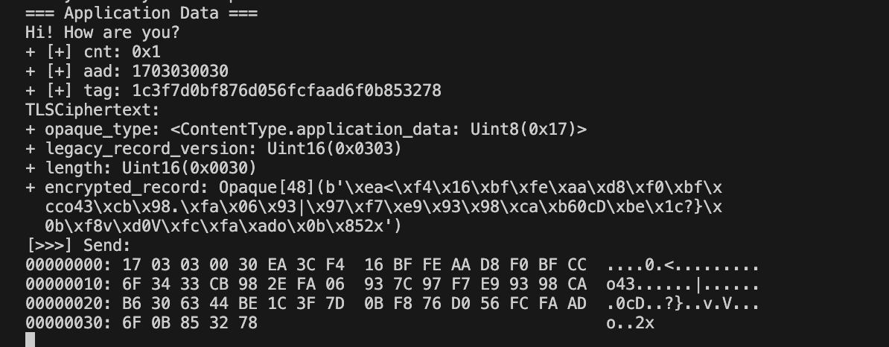

# README

> ⏳ *EN Version coming soon.*
>
> 🥳 *This project starts in 2023.8.4, wish me luck.*

**本项目并非简单的“模拟 TLS 1.3 握手过程”。** 

由于本项目所有消息的字节级设计、交互流程均遵循 [RFC 8446](https://tools.ietf.org/html/rfc8446)，故所有报文内容与现实中网络中通行的完全一致，并可直接与现实中使用 TLS 1.3 的其他主机直接通信。


## Complete Documentation

> **References:**
> - TLS 1.3: [RFC 8446](https://tools.ietf.org/html/rfc8446)
> - server_name ([RFC 6066](https://tools.ietf.org/html/rfc6066))
> - max_fragment_length ([RFC 6066](https://tools.ietf.org/html/rfc6066))
> - supported_groups ([RFC 7919](https://tools.ietf.org/html/rfc7919))
> - use_srtp ([RFC 5764](https://tools.ietf.org/html/rfc5764))
> - heartbeat ([RFC 6520](https://tools.ietf.org/html/rfc6520))
> - application_layer_protocol_negotiation ([RFC 7301](https://tools.ietf.org/html/rfc7301))
> - client_certificate_type ([RFC 7250](https://tools.ietf.org/html/rfc7250))
> - server_certificate_type ([RFC 7250](https://tools.ietf.org/html/rfc7250))
> - early_data ([RFC 8446](https://tools.ietf.org/html/rfc8446))
> - [字节级 TLS 1.3 报文详解](https://tls13.xargs.org/)
> - [详细的 TLS 1.3 握手过程原理](https://github.com/halfrost/Halfrost-Field/blob/master/contents/Protocol/TLS_1.3_Handshake_Protocol.md)
> - [TLS 1.2 vs TLS 1.3](https://www.biaodianfu.com/https-ssl-tls.html)
> - [TLS 1.3 + QUIC 的 python 实现](https://github.com/tex2e/mako-tls13)

1. `./CN_docs/`: 中文文档。本项目中所有实现均基于 RFC 8446（包括报文发送流程、报文的字节级结构等），本文档对具体的协议流程、、
   1. `1-Overview.md`: TLS 1.3 的步骤概述、特性原理概述
   2. `2-Structs_and_Bytes.md`: TLS 1.3 的的基础数据结构及其字节表示定义。
   3. `3-Handshake_Workflow.md`: TLS 1.3 握手过程的各数据结构定义。
   4. `4-Handshake_Principles.md`: TLS 1.3 握手过程的原理。本节转载自网络，本项目中有很多实现细节都参考了本文，故直接贴出。
   5. `5-Extensions.md`: TLS 1.3 所有扩展的定义。包括 server_name, max_fragment_length, supported_groups, use_srtp, heartbeat, application_layer_protocol_negotiation, client_certificate_type, server_certificate_type, early_data。
   6. `6-All_Structs.md`: 所有数据结构定义一览。
   7. `7-Code_Run.md`: 跟随代码，考察本项目中客户端、服务器交互过程，及其他一些细节。
2. `./EN_docs/`: 英文文档。(⏳ Coming soon.)


## Files & Code


### Descriptions to Files According to Functions

#### Client-Server Implementation

- `client.py`: TLS 客户端
- `server.py`: TLS 服务器

#### Cryptographic Algorithms and Protocol Structures


- `crypto_chacha20poly1305.py`: ChaCha20-Poly1305 密码套件的实现。
- `crypto_hkdf.py`: 基于 HMAC 的密钥派生函数（HKDF）的实现。
- `crypto_x25519.py`: ECDH - X25519 密钥交换算法的实现。

#### Protocol Componentss

（详见 `./CN_docs/3-Handshake_Workflow.md`, `4-Handshake_Principles.md`, `./CN_docs/5-Extensions.md` 介绍。）

- `protocol_alert.py`: TLS Alert 实现。
- `protocol_authentication.py`: TLS 协议中的认证机制。
- `protocol_ciphersuite.py`: 不同密码套件的定义和处理。
- `protocol_ext_keyshare.py`: 处理密钥共享扩展。
- `protocol_ext_signature.py`: 处理签名扩展。
- `protocol_ext_supportedgroups.py`: 处理支持的组扩展。
- `protocol_ext_version.py`: 处理版本扩展。
- `protocol_extensions.py`: TLS 扩展的实现。
- `protocol_handshake.py`: TLS 握手过程的实现。
- `protocol_hello.py`: TLS 中 Hello 消息的实现。
- `protocol_recordlayer.py`: TLS 记录层的实现。
- `protocol_ticket.py`: 处理 TLS Session Ticket。
- `protocol_tlscontext.py`: TLS 会话的上下文管理。
- `protocol_types.py`: TLS 协议中使用的各种类型的定义。

#### Utilities and Helpers

- `type.py`: 定义了 `TLS` 的各种数据结构。（详见 `./CN_docs/2-Structs_and_Bytes.md` 介绍。）
- `structmeta.py`: 定义了 `TLS` 的各种数据结构。提供了类型正确性测试（直接运行本脚本）。（详见 `./CN_docs/2-Structs_and_Bytes.md` 介绍。）
- `disp.py`: 实现 hexdump，以 Hex 及 ASCII 形式直接显示 Bin 数据。
- `connection.py`: 抽象了双向 TCP 连接，提供了发送和接收数据的方法。


### Descriptions to Files According to Docs

- `1-Overview.md`: 无。
- `2-Structs_and_Bytes.md`: 实现在 `type.py`, `structmeta.py`。
- `3-Handshake_Workflow.md`, `4-Handshake_Principles.md`: 实现在 `protocal_recordlayer.py`, `protocol_handshake.py`, `/src/protocol_hello.py`。也依赖其他 `protocol_*.py`。
- `5-Extensions.md`: 实现在 `protocol_extensions.py`。
- `6-All_Structs.md`: 无。
- `7-Code_Run.md`: 实现在 `client.py`, `server.py`。


## Manual

### Dependencies

```
python       (Tested with 3.10.13)
cryptography (Tested with 41.0.5)
pycryptodome (Tested with 3.19.0)
```


### Run as Script

需要切换至 `/src`，因为项目代码需要检查 `/src` 目录下的 `/cert` 路径，其中包含 server 证书。

在两个终端分别运行 Server 与 Client。

**Server:**

```bash
cd src
python main_server.py
```

**Client:**

```bash
cd src   
python main_client.py
```

一份典型的运行日志，见 `/examples/server_script.log`, `/examples/client_script.log`。由于本项目所有消息的字节级设计均遵循 [RFC 8446](https://tools.ietf.org/html/rfc8446)，故所有报文内容与现实中网络中通行的完全一致。可查阅两份 log 文件，其中记录了所有交换的报文内容，自然也包括了加密套件、确定的密钥协商算法等（可直接定位到 ServerHello, ClientHello 中查看）。

对于双方协商及后续导出的密钥，可直接在 log 文件中搜索 "shared key", "early secret", "handshake secret", "master secret" 等。可以看到，双方计算出的结果完全一致。

运行后，经过短暂握手过程，即可开始传递应用数据，可任意输入。如下是 client 侧的输入界面，在 “=== Application Data ===” 字样出现后，随时开始输入即可 （下图中，传递应用数据“Hi! How are you?”）。server 侧同理，直接输入内容即可。在一侧发送消息，另一侧也可收到，且可查看完整的字节级报文内容。




### Run as Real TLS 1.3 Server and TLS 1.3 Client Using OpenSSL

本项目并非简单的“模拟 TLS 1.3 握手过程”。由于本项目所有消息的字节级设计均遵循 [RFC 8446](https://tools.ietf.org/html/rfc8446)，故所有报文内容与现实中网络中通行的完全一致。并可直接与现实中使用 TLS 1.3 的其他主机直接通信，也可作为真实可用的 TLS 1.3 服务器、客户端进行交互。

此处，OpenSSL 的 server 监听端口、client 连接端口均在 50007，与项目中的 server 端口、client 端口一致（见 `./src/main_server.py`, `./src/main_client.py`）。以 `-debug` 参数运行，可查看详细的握手过程。

在两个终端分别运行 Server 与 Client。

**Server:**

```bash
cd src
openssl s_server -accept 50007 -cert ./cert/server.crt -key ./cert/server.key -tls1_3 -state -debug
```

**Client:**

```bash
cd src   
openssl s_client -connect 127.0.0.1:50007 -tls1_3 -state -debug
```

一份典型的运行日志，见 `/examples/server_openssl.log`, `/examples/client_openssl.log`。由于本项目所有消息的字节级设计均遵循 [RFC 8446](https://tools.ietf.org/html/rfc8446)，故所有报文内容与现实中网络中通行的完全一致。

可查阅两份 log 文件，其中记录了所有交换的报文内容。内容为 openssl debug 模式输出，相关内容更容易查找。自然也包括了加密套件、确定的密钥协商算法等（可直接定位到 ServerHello, ClientHello 中查看）。对于双方协商及后续导出的密钥，可直接在 log 文件中搜索 "shared key", "early secret", "handshake secret", "master secret" 等。可以看到，双方计算出的结果完全一致。

运行后，经过短暂握手过程，即可开始传递应用数据，可任意输入。如下是 client 侧的输入界面，在 “read R BLOCK” 字样出现后，随时开始输入即可 （下图中，传递应用数据“Hi server! Im always wondering why I have so many projects... I feal frustrated.”）。server 侧同理，直接输入内容即可。在一侧发送消息，另一侧也可收到，且可查看完整的字节级报文内容。

